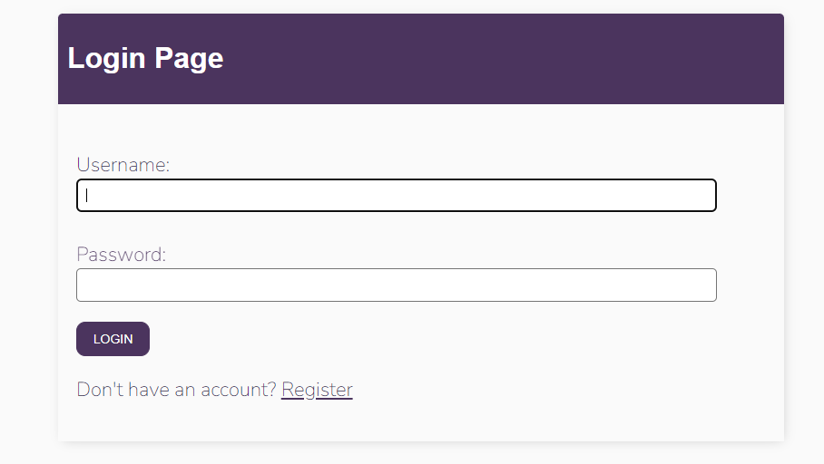
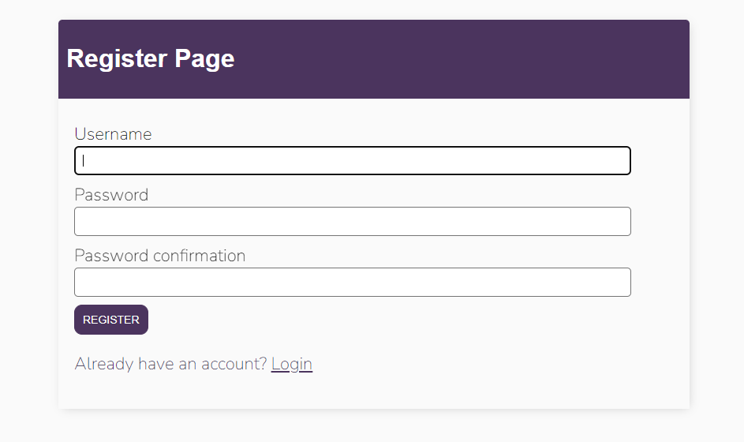
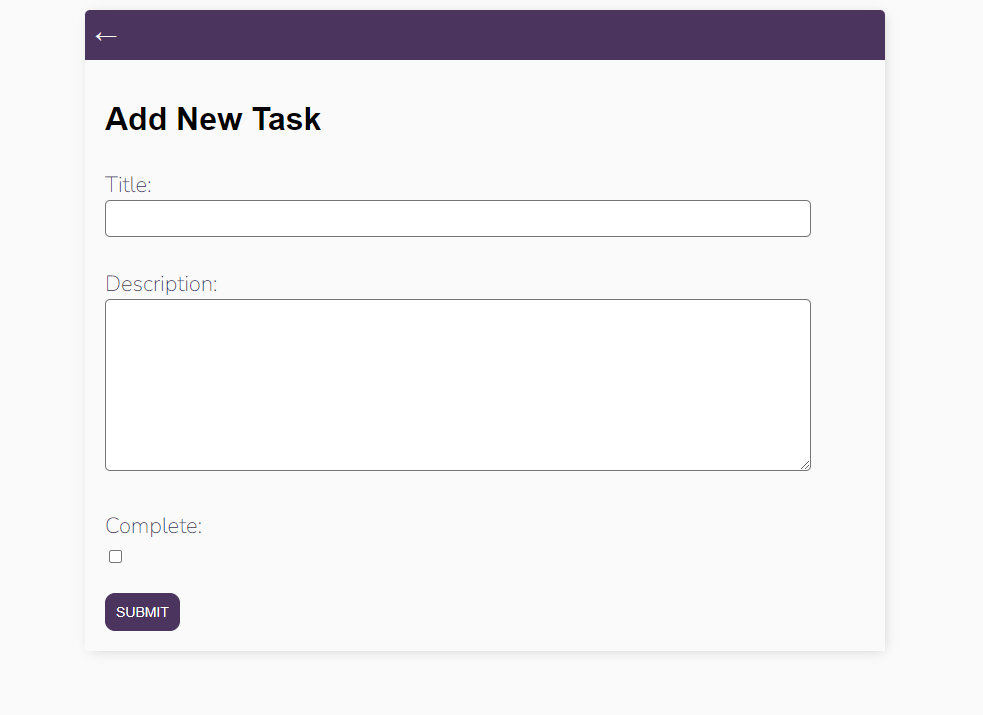

# *TodoListApp*

**TodoListApp** is a simple djangoccapp that lets users create some todo tasks.

## User Stories

The following functionality is completed:

- [X] User can create an account.
- [X] User can login & logout.
- [X] User can create task.
- [X] User can edit task.
- [X] User can mark task as completed.
- [X] User can delete task. 

## Screenshots
Here is an overview of the implemented user stories:

## Author
*Developed by Yves Ronaldo CAZEAU*
